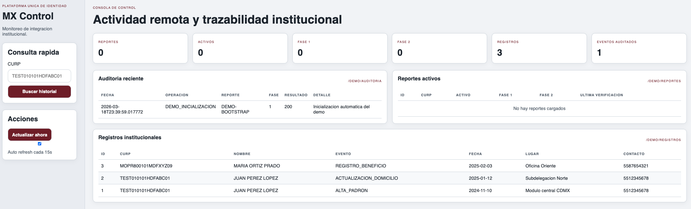

# PUI MX

[](https://github.com/antoniomexdf-boop/pui-mx/actions/workflows/ci.yml)
[](https://opensource.org/licenses/MIT)

PUI MX es una integracion institucional en Spring Boot 3 y Java 17 para interoperar con la Plataforma Unica de Identidad mediante autenticacion JWT, auditoria persistente, consulta de registros institucionales y seguimiento continuo de reportes.

Ya no esta planteado como prototipo academico. El repositorio contiene una base funcional para despliegue institucional, con separacion de datos operativos y datos consultables, consola web de observacion y artefactos de preparacion para Apache + MariaDB.

## Capacidades

- API REST para autenticacion, activacion de reportes, prueba de conectividad y desactivacion de seguimiento.
- Dos bases de datos separadas:
  - `platform_db` para operacion, reportes activos y auditoria.
  - `datos_db` para registros institucionales consultables.
- Flujo de busqueda en tres fases sobre registros institucionales.
- Scheduler de busqueda continua para detectar nuevos movimientos relevantes.
- Consola web en `/dashboard.html` para visualizar reportes, auditoria y actividad.
- Perfil local con H2 y perfil productivo preparado para MariaDB.
- Documentacion operativa y artefactos de despliegue para Apache.

## Arquitectura

```text
Clientes externos / PUI
        |
        v
   Apache HTTPD
        |
        v
 Spring Boot PUI MX
   |            |
   v            v
platform_db   datos_db
```

## Vista del sistema

Consola institucional incluida en la aplicacion:



## Endpoints principales

| Metodo | Ruta | Autenticacion | Proposito |
|---|---|---|---|
| POST | `/login` | No | Emitir JWT |
| POST | `/activar-reporte` | Bearer JWT | Registrar reporte e iniciar fases |
| POST | `/activar-reporte-prueba` | Bearer JWT | Validar contrato y conectividad |
| POST | `/desactivar-reporte` | Bearer JWT | Detener seguimiento continuo |
| GET | `/demo/reportes` | No | Consultar reportes registrados |
| GET | `/demo/auditoria` | No | Consultar bitacora operativa |
| GET | `/demo/registros` | No | Consultar registros institucionales |
| GET | `/demo/registros/{curp}` | No | Filtrar registros por CURP |
| GET | `/demo/resumen` | No | Resumen para consola |
| GET | `/dashboard.html` | No | Consola de observacion |

## Inicio rapido

### Requisitos

- Java 17
- Maven 3.9+

### Ejecutar localmente

```bash
mvn clean test
mvn spring-boot:run
```

La aplicacion quedara disponible en:

- `http://localhost:8080`
- `http://localhost:8080/dashboard.html`

### Empaquetar

```bash
mvn clean package
java -jar target/pui-mx-0.9.7.jar
```

## Produccion

El proyecto ya incluye base para despliegue con Apache + MariaDB en:

- `docs/operacion-produccion/README.md`
- `docs/operacion-produccion/apache-pui-mx.conf`
- `docs/operacion-produccion/docker-compose.yml`
- `docs/operacion-produccion/.env.example`
- `docs/operacion-produccion/run-prod.sh`

Tambien se incluye la documentacion para carga de datos y provisionamiento de bases:

- `docs/operacion-produccion/FORMATO_DATOS_CARGA.md`
- `docs/operacion-produccion/plantilla_registros_institucionales.csv`
- `docs/operacion-produccion/mariadb_crear_bases_y_usuarios.sql`
- `docs/operacion-produccion/mariadb_importacion_datos.md`

## Estado del proyecto

Estado actual: base funcional lista para evolucionarse a productivo institucional.

Cobertura ya validada localmente en el proyecto:

- compilacion y pruebas Maven exitosas
- seguridad JWT operativa
- persistencia dual de datos
- consola de observacion disponible
- documentacion operativa incluida

Pendientes normales antes de una puesta en produccion formal:

- credenciales y secretos reales
- certificados TLS validos
- integracion real con endpoints externos de PUI
- endurecimiento operativo, monitoreo y respaldos

## Documentacion

- `CHANGELOG.md`
- `MANUAL_INSTALACION_Y_PRUEBAS.md`
- `docs/operacion-produccion/`

## Licencia

MIT. Ver `LICENSE.md`.
